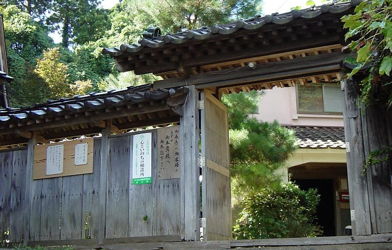

# Amidabutsu.comについて

ようこそ、天徳寺のホームページにお越しくださいました。  
このホームページは、檀家・信徒の皆様、そして天徳寺にご縁のあるすべての方々との繋がりを大切にし、お寺の様子を定期的にお伝えするために運営しております。

---

## ホームページのアドレス「amidabutsu.com」について

このホームページのインターネット上の住所（アドレス）は **`https://www.amidabutsu.com`** です。  
この「`amidabutsu.com`（あみだぶつ ドットコム）」という名前には、お寺としての深い願いが込められています。

私たち浄土宗がもっとも大切にしているご本尊（仏様）は「阿弥陀如来（あみだにょらい）」様です。天徳寺の本堂にお祀りされているのも阿弥陀様です。  
阿弥陀様は、私たちが「南無阿弥陀仏（なむあみだぶつ）」とお念仏をお唱えすれば、いつでも温かく見守り、お救いくださる仏様です。

天徳寺ともっともご縁の深い阿弥陀様のお名前をそのままアドレスにいただき、皆様とお寺を結ぶ架け橋といたしました。

---

## 各ページのご案内

このホームページでは、以下のような情報を発信しています。どうぞ各ページをゆっくりとご覧ください。

* **天徳寺について**  
  天徳寺の歴史や、本堂、お地蔵様、金比羅堂（こんぴらどう）など、緑豊かな境内の様子を写真と共にご紹介しています。
* **能登半島地震について**  
  震災時のお寺の状況や、皆様へのお知らせを掲載しています。
* **浄土宗について**  
  私たちが大切にしている「お念仏」の教えや歴史について、わかりやすくお伝えしています。
* **年中行事日程**  
  お盆やお彼岸、法要など、天徳寺で毎年行われる主な行事のスケジュールをご案内しています。
* **連絡先・リンク**  
  お寺へのお問い合わせ方法や、浄土宗に関連するホームページのご案内です。

いつも温かくお寺を支えてくださる皆様の心のよりどころとなるよう、これからも丁寧にお寺の情報を届けてまいります。
