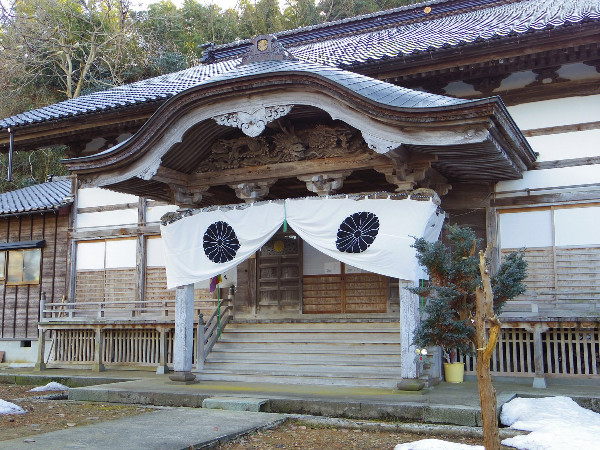
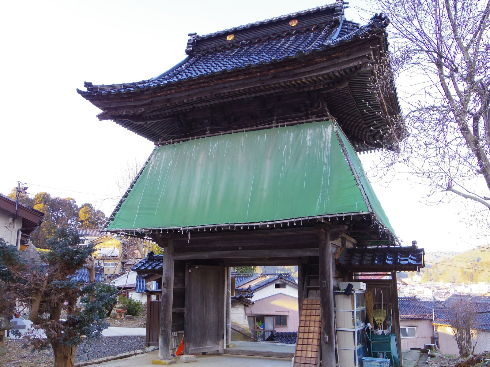

# 避難先・遠方でお過ごしの檀信徒の皆様へ
## 〜どこにいても、お念仏でつながる安心（あんじん）〜

能登の地を離れ、不自由な避難生活や慣れない土地での仮住まいを余儀なくされている皆様に、心よりお見舞い申し上げます。

住み慣れた故郷、そしてご先祖様が眠るお寺から遠く離れ、**「お墓参りに行けない」「お仏壇にお給仕もできない」**と、胸を痛めておられる方も多いのではないでしょうか。

どうぞ、ご自分を責めないでください。皆様がどこにいらっしゃっても、天徳寺と皆様を結ぶ縁、そして阿弥陀様との絆が変わることは決してありません。

---

## 1. 形がなくても、阿弥陀様はあなたと共にいます

浄土宗の教えの根幹は、**「南無阿弥陀仏」とお念仏を称えるものは、どんな場所にいても阿弥陀様が等しく包み込み、決して見捨てない（摂取不捨・せっしゅふしゃ）**という慈悲にあります。

いま、皆様の手元にお仏壇や光り輝くお位牌がなくても、皆様の信仰やご先祖様を想う心に少しの陰りも生じません。皆様がお念仏を称えるその場所こそが、そのまま阿弥陀様とご先祖様につながる、大切な「本堂」となるのです。

---

## 2. 避難先でできる「小さなお参り」のすすめ

特別な仏具が揃っていなくても、今日からできる「心の供養」があります。どうぞ無理のない範囲で、日々の生活に取り入れてみてください。

* **西の空を向いて手を合わせる（西方遥拝）**
  夕日の沈む西の彼方には、阿弥陀様がいらっしゃる極楽浄土があります。また、いま皆様がいらっしゃる場所から見て「能登の天徳寺」がある方向を思い浮かべ、そっと手を合わせてみてください。そのお念仏は、まっすぐにご先祖様へ届きます。

* **この画面を「お参りの拠り所」として**
  スマートフォンの画面に映るお名号や懐かしい境内の風景を、お参りの目印（本尊）としてお使いいただけるよう、以下の画像を切り替えて表示できます。

=== "お名号（南無阿弥陀仏）"
    

=== "天徳寺の本堂・境内 1"
    

=== "天徳寺の本堂・境内 2"
    

浄土宗では、「南無阿弥陀仏」の言葉そのものに阿弥陀様のすべてが宿ると教えられます（名号本尊）。スマートフォンの画面に映るこのお名号（あるいは懐かしい故郷の風景）に向かって、どうぞそのまま手を合わせ、お念仏をお称えください。その画面が、あなたと大切な人をつなぐ窓となります。

---

## 3. 離れていても、私たちはつながっています

皆様の安全と健康、復興への歩みが進むことを願い、日々お念仏を捧げております。物理的な距離はあっても、私たちの心は「南無阿弥陀仏」の声を通じて、いつも一つに響き合っています。

現地へすぐに赴くことが難しい時期であっても、皆様に代わってお勤め（代理参拝・回向）をさせていただくなど、いまできる形でお手伝いをしたいと考えております。

* 「今年のお盆や法要はどうすればいいだろうか」
* 「避難先での暮らしのなかで、少し話を聞いてほしい」

どのような小さな不安でも構いません。どうぞひとりで抱え込まず、下記の窓口からいつでも近況や想いをお寄せください。

皆様の心に、少しでも穏やかな灯がともりますよう、遥かにお祈り申し上げます。

合掌
天徳寺

---

### お問い合わせ・近況報告窓口
[フォームを開く](https://docs.google.com/forms/d/e/1FAIpQLSdrSQvlcGb1jlEP0nCwSU4JuKT3h6xASMN0rRmjvhH3O-keMQ/viewform?usp=sf_link)

### E-Mail:
master_at_amidabutsu.com (_at_ をアットマークに変えてください）
