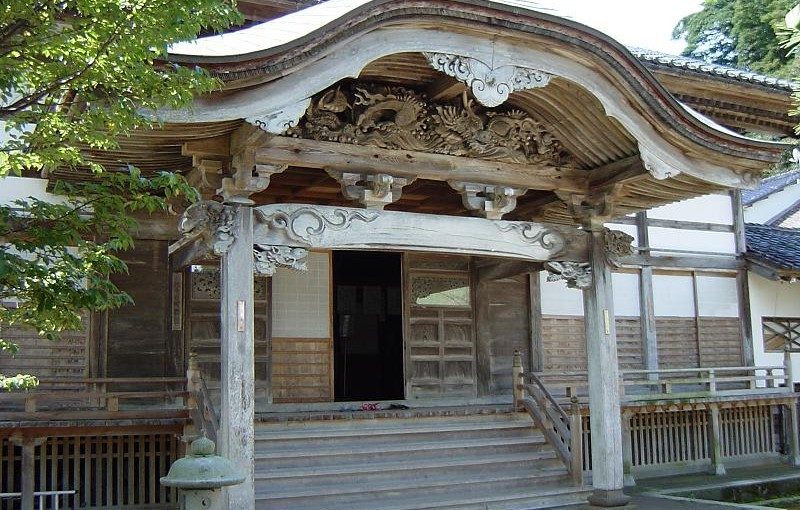

# 浄土宗光明山天徳寺へようこそ

天徳寺のホームページをご覧いただき、誠にありがとうございます。  
当山は、石川県能登町にある浄土宗のお寺です。お檀家・信徒の皆様、そして地域の皆様に支えられながら、お念仏の灯（ともしび）を今日まで繋いでまいりました。

---

!!! warning "重要なお知らせ：地震による境内・墓地の安全確認と立ち入りについて"
    現在、天徳寺では能登半島地震の影響により、本堂、山門、境内地、およびお墓がある墓地に甚大な被害が出ております。  
    いたるところに崩落の危険がある箇所が残っており、皆様の安全を確保することが難しい状況です。
    
    そのため、誠に心苦しい限りではございますが、**お盆のお墓参りや位牌堂へのお参りを含め、境内地および墓地への立ち入りは、可能な限りお控えくださいますようお願い申し上げます**。
    
    お檀家・信徒の皆様の安全と健康維持を第一にお考えいただきますよう、何卒ご理解とご協力をお願い申し上げます。

---

## 被災に伴うご連絡・ご相談について

被災された皆様に心よりお見舞い申し上げますと共に、皆様の生活再建を第一にお祈りいたしております。  
このような状況下ではございますが、お檀家・信徒の皆様におかれまして、仏事やご法要、お困りごとや気になることがございましたら、どうぞお気軽にご相談ください。

* **インターネットでのお問い合わせ**  
  現在、お寺のお電話が非常に繋がりにくい状態となっております。恐れ入りますが、ご用件は以下のリンク（フォーム）よりお寄せいただけますと幸いです。  
  👉 [天徳寺 ご連絡・お問い合わせフォーム](https://docs.google.com/forms/d/e/1FAIpQLSdrSQvlcGb1jlEP0nCwSU4JuKT3h6xASMN0rRmjvhH3O-keMQ/viewform?usp=sf_link)

---

## 天徳寺と阿弥陀様のご縁

当山のホームページアドレスは「`amidabutsu.com`」となっております。  
これは、浄土宗の信仰の中心であり、私たちをいつでも救ってくださる仏様「阿弥陀如来（あみだにょらい）」様のお名前からいただきました。

地震の影響で直接お参りいただくことが難しい日々が続いておりますが、皆様が日々の暮らしの中で「南無阿弥陀仏」とお念仏をお唱えする時、阿弥陀様はいつも温かく見守ってくださいます。

お寺の詳しい歴史や、本堂などの境内のご案内は、[天徳寺について](about.md) のページをご覧ください。
