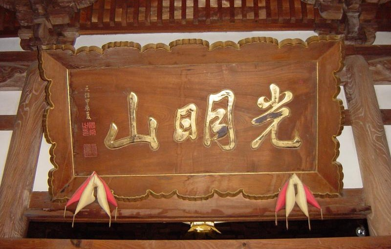

# 浄土宗（じょうどしゅう）について

天徳寺は、今から約850年前に**法然上人（ほうねんしょうにん）**が開かれた「**浄土宗（じょうどしゅう）**」のお寺です。  
ここでは、檀家・信徒の皆様に、私たちが大切にしている宗派の教えや特徴を、わかりやすく簡単にご紹介します。

---

## 1. 浄土宗ってどんな教え？

浄土宗の教えは、実はとてもシンプルで優しいものです。

その核心は、**「南無阿弥陀仏（なむあみだぶつ）」とお念仏をお唱えすること**、これに尽きます。

法然上人が活躍された平安時代末期から鎌倉時代にかけては、厳しい修行をしたり、難しいお経をたくさん読んだりできる、一握りの特別な人々だけが救われると考えられていました。

しかし、法然上人は**「厳しい修行ができない人や、お経が読めない一般の人々こそ、一番救われなければならない」**と考えました。そして、仏教の長い歴史の中から見つけ出したのが、阿弥陀様（あみださま）の優しいお約束です。

> **阿弥陀様のお約束**
> 「どんな人でも、私の名前（南無阿弥陀仏）を声に出して呼んでくれたなら、必ず極楽浄土（ごくらくじょうど）へお迎えします」

このお約束を信じ、日々の生活の中で「南無阿弥陀仏」とお唱えすることが、私たちの信仰の基本です。

---

## 2. 浄土宗の基本データ

* **ご本尊（信仰の中心となる仏様）**  
  **阿弥陀如来（あみだにょらい）**  
  限りない知恵と命の光で、私たちをいつも温かく照らし、包み込んでくださる仏様です。
* **宗祖（宗派を開いた方）**  
  **法然上人（ほうねんしょうにん）**  
  「すべての人を救いたい」という一心でお念仏の教えを広められました。とても温和で知性あふれるお方でした。
* **総本山（もっとも中心となるお寺）**  
  **知恩院（ちおんいん）**  
  京都の東山にあります。法然上人がお念仏の教えを広め、お亡くなりになったゆかりの地です。

---

## 3. 日常生活とお念仏

お念仏をお唱えするのは、お寺の法要の時だけではありません。  
嬉しい時、困った時、あるいはご先祖様を想う時、いつでも「南無阿弥陀仏」と口にしてみてください。

「南無（なむ）」とは「信じておまかせします」という意味です。「南無阿弥陀仏」は、**「阿弥陀様、どうぞよろしくお願いします」**という、仏様への信頼と感謝の言葉でもあります。

お念仏をお唱えすることで、心がすっと穏やかになり、日々を明るく元気に過ごすエネルギーをいただけます。
