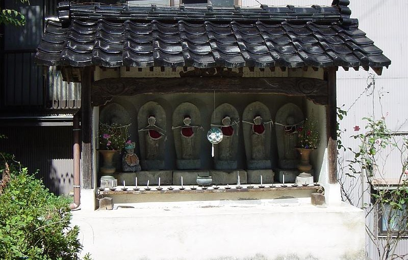

# 天徳寺年中行事日程

**修正会**

  * 1月1日

**御忌会**

  * 2月23日〜2月25日

**涅槃会**

  * 3月15日

**春彼岸会**

  * 3月春分

**祀堂会**

  * 6月第三土・日曜日

**盂蘭盆施餓鬼会**

  * 8月15日

**秋彼岸会**

  * 9月秋分

**十夜会**

  * 11月15日

**仏名会**

  * 12月1日

